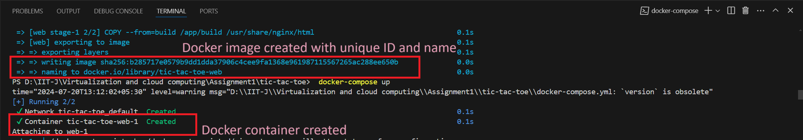
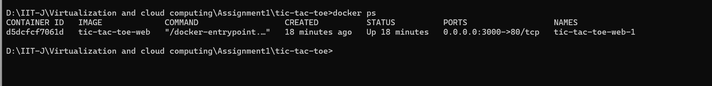
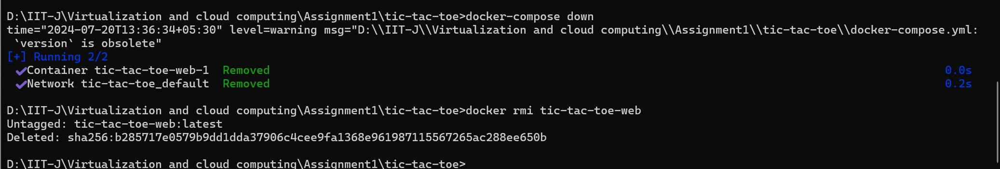

# Tic-Tac-Toe React App

## Project Description

This is a simple Tic-Tac-Toe game built with React. The game allows two players to take turns marking spaces in a 3×3 grid. The player who succeeds in placing three of their marks in a horizontal, vertical, or diagonal row wins the game.

## Functionality

- The game board is a 3x3 grid of squares.
- Players take turns clicking on empty squares to mark them with either 'X' or 'O'.
- The game checks for a winner after each turn.
- The status displays the current player or the winner.

## Dockerization

The app is containerized using Docker. We use a multi-stage build to first build the React application and then serve it using nginx.

### Dockerfile

```dockerfile
# Dockerfile
# Stage 1: Build the React app
FROM node:16 AS build

WORKDIR /app

COPY package.json ./
COPY package-lock.json ./
RUN npm install

COPY . ./
RUN npm run build

# Stage 2: Serve the React app using nginx
FROM nginx:alpine

COPY --from=build /app/build /usr/share/nginx/html

EXPOSE 80

CMD ["nginx", "-g", "daemon off;"]
```

Explanation:

    Stage 1: Build the React app:
        Uses the node:16 image to build the React application.
        Sets the working directory to /app.
        Copies package.json and package-lock.json to the container and installs the dependencies.
        Copies the rest of the application files and builds the React application.

    Stage 2: Serve the React app using nginx:
        Uses the nginx:alpine image to serve the built React application.
        Copies the build output from the previous stage to the nginx html directory.
        Exposes port 80 and starts nginx.

### docker-compose.yml
```yml file
version: '3.8'

services:
  web:
    build: .
    ports:
      - "3000:80"
```
Explanation:

    Defines a service named web that builds the Docker image from the current directory (.).
    Maps port 3000 on the host to port 80 in the container, allowing access to the application at http://localhost:3000.

## Running the Application

    1. Build and Run the Docker Container:
            docker-compose build
            docker-compose up
    2. Access the Application:
            Open your browser and navigate to http://localhost:3000 to play the game.
    

## attached screenshot of image creation and container creation
  note: please cltr+click to view the screenshot, screenshot is included in the project folder itself.

## list the running containers
''' docker ps ```
  here is the screenshot for docker ps command which lists the containers running.

## remove the docker containers and docker images -- to free up resources
  here is the screenshot of commands executed to remove containers and images

    Explanation:
            1. We need to stop the running containers before removing/deleting the containers or images
            2. If docker-compose was used, then it makes it easier to stop and remove images, it does so in a single command --> docker-compose down
            3. There is one more way to stop the containers first and then remove them by using
                    docker stop [container id]  -- this will stop the running container
                    docker rm [container id]  -- this will remove/delete the container
            4. Thenafter we can safely remocve the docker image
                    docker rmi [name of the image]  -- this will remove/delete the docker image.

"# Docker-assignment" 
